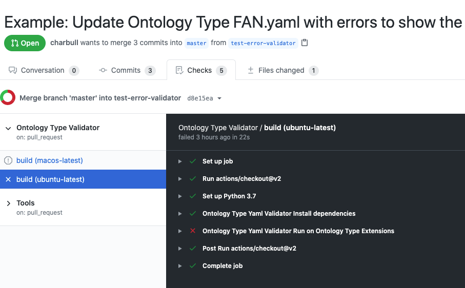

# Process Overview

An overview of the process is depicted in the figure below.


Start by going through the existent ontology types [[yaml]](./../yaml).

If the types cover what you need to model, then you may skip to the [Building Configuration part](#building-configuration).

Otherwise, follow the next [step](#ontology-types-extension).

## Ontology Types Extension

The overall steps for the ontology extension are depicted in the figure below.


To extend the Ontology with new entity types, fields, or other elements, you are required to propose such extensions in yaml files and submit a pull request.

* Upon each pull request, the Ontology Types Validator [link](https://github.com/google/digitalbuildings/tree/master/tools/validators/ontology_validator) is triggered by a GitHub action. For example, the following pull request shows that some types are not valid as shown in the figure below (please expand to see the detailed error message: [https://github.com/google/digitalbuildings/pull/62/checks?check_run_id=920485160](https://github.com/google/digitalbuildings/pull/62/checks?check_run_id=920485160)



* Iterate on your pull request until the validation is successful.

* Ask for a review from the Open Process Library team.

## Building Configuration

The building configuration is a YAML file containing various information and requirements about the building, as detailed [[link]](https://github.com/google/digitalbuildings/blob/master/ontology/docs/building_config.md).

You may generate the building configuration file in YAML using the method of your choice.

### GUID Generation

The GUID Generator allows users to generate [UUID4](https://datatracker.ietf.org/doc/html/rfc4122.html) values for entities present in a building configuration instance. **GUIDs are required for valid building configurations.** The GUID Generator is not a stand-alone application and must be run through the [toolkit](https://github.com/google/digitalbuildings/tree/master/tools).

To install dependencies for the GUID Generator, run setup in the [tools](https://github.com/google/digitalbuildings/tree/master/tools) directory.
* For Windows: `py setup.py install`
* For Unix-based systems: `sudo python3 setup.py install`

### Validating Building Config

The ontology instance validator ensures that the building configuration file is consistent with the ontology types.

#### Case: No changes to the ontology types

If no changes have been made to the ontology types or if the changes are merged into the master branch, you can apply the following to test your generated building config:

* Install the required dependencies using the setup.py file from the following repo: [[link]](https://github.com/google/digitalbuildings/tools/validators/instance_validator) and run `python3 setup.py install`.
* Run the following command to validate the building configuration:
```
python3 instance_validator.py --input path/to/YOUR_BUILDING_CONFIG.yaml
``` 

#### Case: Changes to the ontology types

If changes have been made to the ontology types and they are not merged into the master branch:

* You need to point the Instance Validator to the newly added types.
* Iterate until the instance validator passes.

#### Telemetry Validation

Once the building configuration file has been validated for the types, the next validation step checks for telemetry data. Please follow the step in [telemetry-validation](https://github.com/google/digitalbuildings/tree/master/tools/validators/instance_validator#telemetry-validation).

### Toolkit

The toolkit serves as a single point of entry for all Open Process Library tools, but currently only supports GUID generation and instance validation. To specify instance validation, provide `-v` or `--validate`, and to run the GUID Generator provide `-g` or `--generate`.

To run:
* Install the required dependencies for [Instance Validator](https://github.com/google/digitalbuildings/tree/master/tools/validators/instance_validator) and [GUID Generator](https://github.com/google/digitalbuildings/tree/master/tools/guid_generator).
* For Windows run `py toolkit.py -g -v --input path/to/YOUR_BUILDING_CONFIG.yaml`.
* For Unix-based systems run `python3 toolkit.py -g -v --input path/to/YOUR_BUILDING_CONFIG.yaml`.

Further documentation for the toolkit can be found [here](https://github.com/google/digitalbuildings/tree/master/tools).

#### Next Step

Once the building configuration file is valid, please follow the instructions in your SOW.